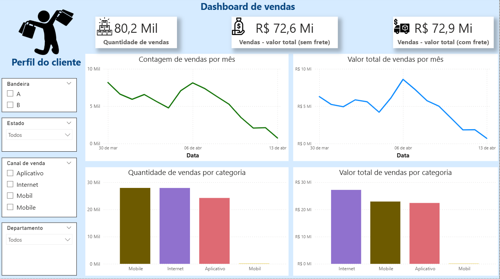
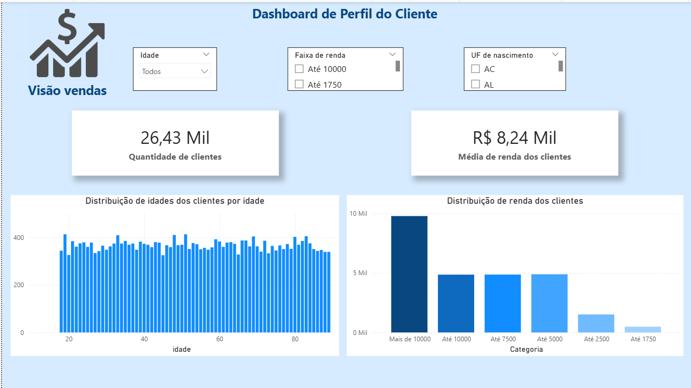

# Dashboard de Vendas e Perfil de Clientes – E-commerce (Power BI)
Projeto de visualização e análise de dados de um e-commerce, com foco em acompanhar resultados de vendas e entender o perfil dos clientes para apoiar decisões de negócio em marketing, canais e operações.
​

## 🎯 Objetivo do projeto
- Monitorar a performance de vendas (quantidade de pedidos e faturamento) ao longo do tempo, por categoria e canal de venda.
- Analisar o perfil dos clientes (idade, renda e UF de nascimento) para identificar segmentos mais relevantes para o negócio.
- Disponibilizar um dashboard interativo em Power BI que permita filtrar informações por diferentes dimensões (bandeira, estado, canal, departamento, faixa de renda, idade).

Este projeto foi desenvolvido como parte do Desafio: “Preveja os resultados de um e-commerce utilizando o Power BI” da DNC.

## 🧰 Dados e ferramentas
- Ferramentas:
    - Power BI (modelagem, DAX, criação de dashboards)

- Principais tabelas (nomes podem variar conforme o dataset da DNC):
    - Tabela de pedidos/vendas: data, categoria/canal, valor com e sem frete.
    - Tabela de clientes: idade, renda, UF de nascimento.

## 📊 Visões do dashboard
1. Dashboard de Vendas
Principais elementos:

- Cartões de KPI:
    - Quantidade total de vendas.
        - Valor total de vendas sem frete.
        - Valor total de vendas com frete.

    - Gráficos de linha:
        - Contagem de vendas por mês.
        - Valor total de vendas por mês.

    - Gráficos de barras:
        - Quantidade de vendas por categoria.
        - Valor total de vendas por categoria.

    - Filtros (slicers):
        - Bandeira, Estado, Canal de venda, Departamento.

    2. Dashboard de Perfil do Cliente
    Principais elementos:

    - Cartões de KPI:
        - Quantidade total de clientes.
        - Média de renda dos clientes.

    - Gráficos:
        - Distribuição da idade dos clientes.
        - Distribuição da renda por faixas/categorias.

    - Filtros (slicers):
        - Idade, Faixa de renda, UF de nascimento.

    ## 🖼 Screenshots:
    <div style="display: flex; gap: 10px;">
      
      
    </div>

    ## 🔍 Principais insights de negócio
    Alguns exemplos de insights que podem ser obtidos com o dashboard (ajuste com números reais que você observar):
    - Determinadas categorias/canais concentram a maior parte das vendas e do faturamento, indicando onde focar campanhas e promoções.
    - Há faixas de idade e renda com maior participação na base de clientes, o que ajuda a definir público-alvo de ações de marketing.
- A evolução mensal das vendas mostra períodos de maior e menor demanda, úteis para planejamento de estoque e metas comerciais.

## 🧠 Decisões que o dashboard apoia
- Priorização de canais de venda com maior volume e valor de pedidos.
- Definição de campanhas segmentadas por perfil de cliente (idade, renda, estado).
- Planejamento de metas e acompanhamento de resultados ao longo do tempo a partir dos KPIs apresentados.

## 📁 Estrutura do repositório
Sugestão de organização:

```bash
.
├── data/                # (opcional) arquivos de dados abertos ou amostragem
├── pbix/                # arquivo .pbix do projeto
├── images/              # screenshots do dashboard
└── README.md            # este arquivo
```

## ▶️ Como visualizar
Baixe o arquivo .pbix na pasta pbix/.

Abra o arquivo no Power BI Desktop.

Utilize os filtros (slicers) para explorar diferentes cenários de vendas e perfis de clientes.

